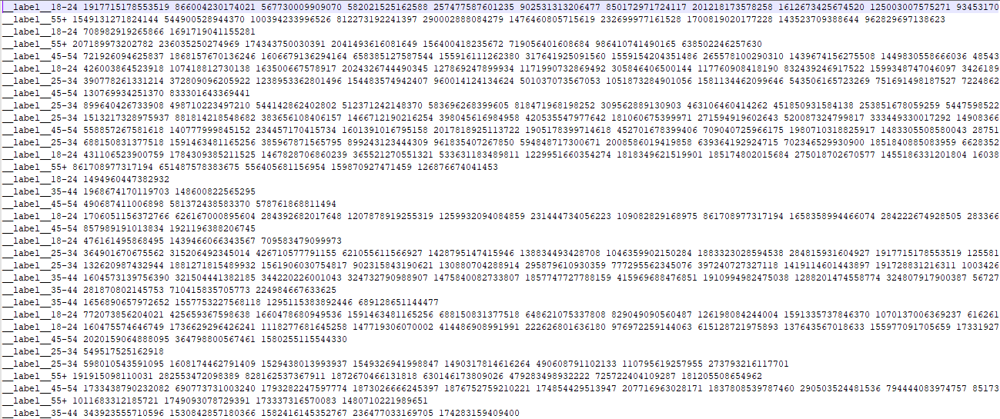

# Agedetector Group dùng thuật toán KNN để giải

Mô phỏng bài toán 
File dữ liệu train như sau 

## Hướng giải
Do bài toán này thuộc dạng Supervised learning.

Tìm hiểu dữ liệu sẵn có ta thấy 5 cụm như sau:
__label__18-24, __label__25-34, __label__35-44, __label__45-54, __label__55+. 

Từ đó dùng một số phép thống kê làm cơ sở để gán lớp cho mỗi groupID trong file dữ liệu train 

Ta quy gọn bài toán N chiều về bài toán chỉ có 5 chiều. 
